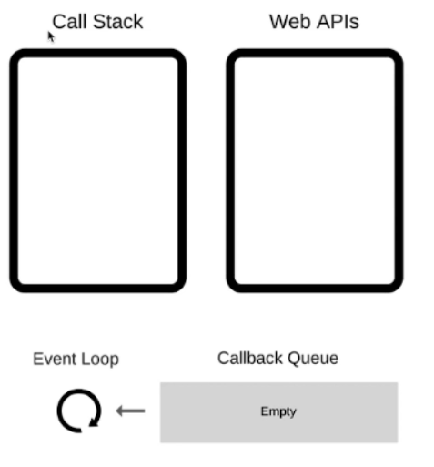

### 异步

#### 单线程

js是单线程语言，采用异步可以提高程序运行效率。
同步会阻塞代码执行，异步不会

异步
- 定时 setInterval、setTimeout
- promise
- 图片加载
- ajax网络请求


#### event loop



运行程序进入call stack，同步程序直接运行结束，异步程序WebAPI(宏任务)/微任务等待，等到可以运行时进入callback queue，eventLoop在call stack空(同步程序执行完)后查看callback queue执行其中的异步程序。

##### 宏任务与微任务

宏任务
- setInterval、setTimeout、AJAX、DOM事件
- 游览器规定

微任务 
- Promise、async/await
- ES6语法规定

微任务放在`micro task queue`中，在call stack清空后先执行微任务在尝试DOM渲染，渲染结束后出发eventLoop执行宏任务

#### Promise

##### 三种状态

- pending
- resolved
  then只在resolved之后执行，出现rejected后不执行then
- rejected
  catch只在rejected后执行，执行后如果不抛出错误则变为resolved

```js
// 第一题
Promise.resolve().then(() => {
    console.log(1)
}).catch(() => {
    console.log(2)
}).then(() => {
    console.log(3)
})
// 1 3

// 第二题
Promise.resolve().then(() => {
    console.log(1)
    throw new Error('erro1')
}).catch(() => {
    console.log(2)
}).then(() => {
    console.log(3)
})
// 1 2 3

// 第三题
Promise.resolve().then(() => {
    console.log(1)
    throw new Error('erro1')
}).catch(() => {
    console.log(2)
}).catch(() => { // 注意这里是 catch
    console.log(3)
})
// 1 2
```

##### async await

- async await是promise的语法糖
  执行async函数返回promise对象
- await返回的是相当于promise的then，如果接收的是rejected，则会报错await不运行
  await 400 === Promise.resolve(400)
- try catch 相当于promise的.catch()

```js
async function async1 () {
  console.log('async1 start')
  await async2()
  console.log('async1 end') 
}

async function async2 () {
  console.log('async2')
}

console.log('script start')
async1()
console.log('script end')

//script start async1 start async2 script end async1 end  
```

只要遇到了 `await` ，后面的代码都相当于放在 callback 里。

#### for of
for in(forEach) 同步遍历
for of 异步遍历

```js
function multi(num) {
    return new Promise((resolve) => {
        setTimeout(() => {
            resolve(num * num)
        }, 1000)
    })
}
// 使用 forEach ，是 1s 之后打印出所有结果，即 3 个值是一起被计算出来的
function test1 () {
    const nums = [1, 2, 3];
    nums.forEach(async x => {
        const res = await multi(x);
        console.log(res);
    })
}
test1();

async function test2 () {
    const nums = [1, 2, 3];
    for (let x of nums) {
        // 在 for...of 循环体的内部，遇到 await 会挨个串行计算
        const res = await multi(x)
        console.log(res)
    }
}
test2()
```