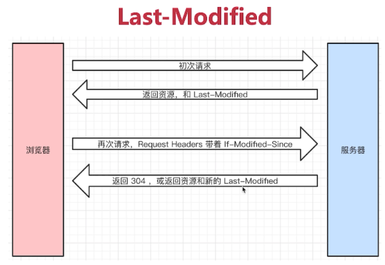

#### 状态码

- 1xx 服务器收到请求
- 2xx 请求成功
- 3xx 重定向 301永久 302临时 304资源未被修改(http本地缓存)
- 4xx 客户端错误 403无权限 404资源未找到
- 5xx 服务端错误 500 504网关超时

#### Restful API

把每个url当做一个唯一资源,不使用url参数，用method表示操作类型
传统API `/api/list?pageIndex=2` `/api/get-blog?id=100`
Restful API `/api/list/2`

#### http headers

`request url` `method` `status code`

##### request headers
`Accept`游览器可接收的数据格式
`Accept-Encoding:gzip`
`Accept-Language`
`Connection: keep-alive`
`cookie`
`Host`
`User-Agent`游览器信息
`Content-Type` 如application/json

##### response headers

`Connection: keep-alive`
`Content-Encoding:gzip`
`Content-Type`
`Content-length`
`Set-Cookie`
`Cache-Control:max-age = xxx` 单位是s 表示可缓存时间

#### 缓存相关的headers
`Cache-Control`
`Last-Modified`
`If-Modified-Since`
`Etag`
`If-None-Match`

#### http缓存

静态资源(js css img)可以被缓存

##### 强制缓存

强制缓存由sever端决定是否缓存(有些数据可以缓存有些不可以，所以由sever端来决定)
cache-control: max-age/no-cache/no-store/private/public no-cache不本地缓存 no-store是不用本地缓存也不用sever端的缓存 public/private针对中间代理是否可以缓存

##### 协商缓存

服务端缓存策略：由服务端判断客户端是否可以使用它本地的资源
服务端资源和客户端资源一致则返回304 客户端调用本地缓存；不一致返回200和最新资源

使用`Last-Modified`和`Etag`判断是否一致 优先使用Etag 
- last-modified只能精确到秒级
- 资源被重复生成，Etag不变但last-modified可能改变

#### 刷新

正常刷新:强制缓存有效，协商缓存有效
手动刷新:强制缓存失效，协商缓存有效
强制刷新:强制缓存失效，协商缓存失效